===============
 Enduser Manual
===============
An end-user submits a smart connector job, monitors the job, visualises
job results and publishes the result to the public BDP index. In this
documentation, following topics are covered:

* :ref:`getting_chiminey_account`

* :ref:`login`

* :ref:`logout`

* :ref:`configure_platform_settings`

* :ref:`submit_job`

* :ref:`monitor_job`

* :ref:`terminate_job`

* :ref:`manage_presets`

.. _getting_chiminey_account:

Getting Chiminey Account
------------------------

Chiminey accounts are managed by admin users. Therefore, in order to get
access to a specific Chiminey server, the end-user should contact the
admin of the Chiminey server.

.. _login:

Login
-----

End-users login via the web interface of the Chiminey server

1. Click 'login' on the home page
2. Enter Chiminey credentials
3. Click 'Login'

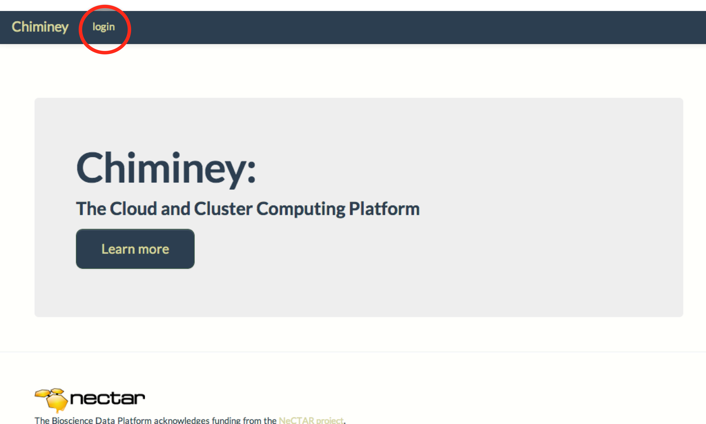

.. _logout:

Logout
------

1. click 'Logout

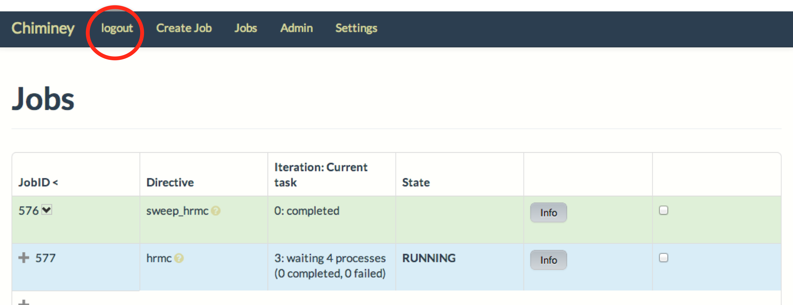

.. _configure_platform_settings:

Platform Settings Configuration
-------------------------------

A Chiminey server supports two types of platforms: computation and
storage. A computation platform is where the core functionality of a
smart connector is executed while a storage platform is the destination
of the smart connector output. Prior to submitting a job, end-users need
to register at least one computation and one storage platforms. In this
section, following topics are covered:

-  :ref:`register_computation_platform`
-  :ref:`register_storage_platform`
-  :ref:`update_platform`
-  :ref:`delete_platform`

.. _register_computation_platform:

Registering Computation Platform
^^^^^^^^^^^^^^^^^^^^^^^^^^^^^^^^

Two types of computation platforms can be registered within the Chiminey
UI. The types are :ref:`cloud_comp_pltf` and :ref:`cluster_unix_platform`.

.. _cloud_platform:

Cloud Computation Platform
""""""""""""""""""""""""""

1.  Navigate to the Chiminey server homepage
2.  Log in with credentials
3.  Click ``Settings``
4.  Click ``Computation Platform`` from the ``Settings`` menu
5.  Click ``Add Computation Platform``
6.  Click the ``Cloud`` tab.
7.  Select the platform type from the drop down menu. You may have  access to more than one type of cloud service, e.g., NeCTAR and Amazon.
8.  Enter a unique platform name. This name should be something you could remember.
9.  Enter credentials such as EC2 access key and EC2 secret key
10. You can optionally enter the VM image size
11. Click ``Add``. The newly added cloud-based computation platform will be displayed.

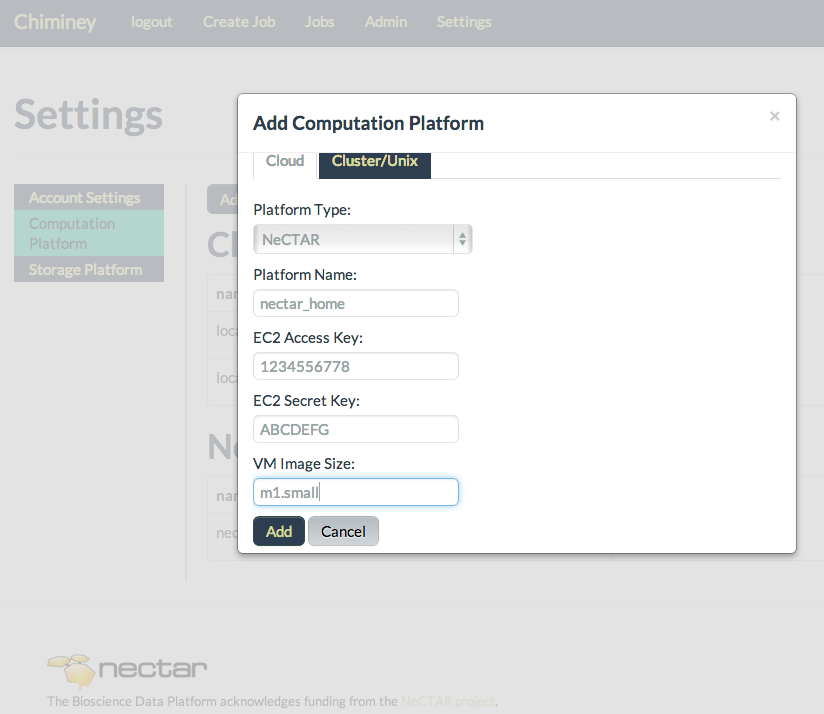

    Figure. Adding cloud-based computation platform

.. _cluster_unix_platform:

Cluster/Unix  Computation Platform
""""""""""""""""""""""""""""""""""

1.  Navigate to the Chiminey server homepage
2.  Log in with credentials
3.  Click ``Settings``
4.  Click ``Computation Platform`` from the ``Settings`` menu
5.  Click ``Add Computation Platform``
6.  Click the ``Cluster/Unix`` tab.
7.  Enter a unique platform name. This name should be something you could remember.
8.  Enter IP address or hostname of the cluster head node or any Unix server
9.  Enter credentials, i.e. username and password. Password is not stored in the Chiminey server. It is temporarily kept in memory Chiminey server to the computation platform.
10. Enter homepath. This is the location where .ssh directory resides. The home path is needed to store a public key on the cluster head node or the unix server.
11. Enter rootpath. The root path is used as the working directory during execution.
12. Click ``Add``
13. The newly added computation platform will be displayed under ``Cluster/Unix`` list.

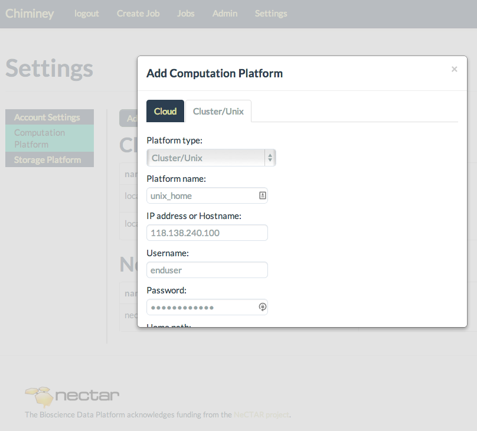

    Figure. Adding cluster/unix-based computation platform

.. _register_storage_platform:

Registering Storage Platform
^^^^^^^^^^^^^^^^^^^^^^^^^^^^

Two types of storage platforms can be registered within the Chiminey UI. The types are :ref:`unix_storage_platform` and :ref:`mytardis_storage_platform`.

.. _unix_storage_platform:

Unix Storage Platform
"""""""""""""""""""""

1.  Navigate to the Chiminey server homepage
2.  Log in with credentials
3.  Click ``Settings``
4.  Click ``Storage Platform`` from the ``Settings`` menu
5.  Click ``Add Storage Platform``
6.  Click the ``Unix`` tab.
7.  Enter a unique platform name. This name should be something you could remember.
8.  Enter IP address or hostname of the unix-based storage
9.  Enter credentials, i.e. username and password. Password is not stored in the Chiminey server. It is temporarily kept in memory to to establish a private/public key authentication from the Chiminey server to the storage.
10. Enter homepath. This is the location where ``.ssh`` directory resides. The home path is needed to store a public key on the unix server.
11. Enter rootpath. The root path is used as the working directory of the Chiminey server.
12. Click ``Add``
13. The newly added storage platform will be displayed under ``Unix`` list.

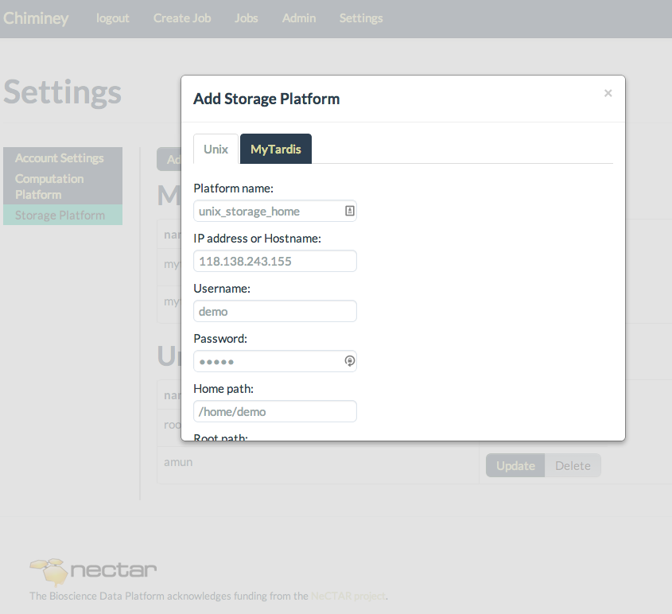

    Figure. Adding unix-based storage platform

.. _mytardis_storage_platform:

MyTardis Storage Platform
"""""""""""""""""""""""""

1.  Navigate to the Chiminey server homepage
2.  Log in with credentials
3.  Click ``Settings``
4.  Click ``Storage Platform`` from the ``Settings`` menu
5.  Click ``Add Storage Platform``
6.  Click the ``MyTardis`` tab.
7.  Enter a unique platform name. This name should be something you could remember.
8.  Enter IP address or hostname of the MyTardis instance
9.  Enter credentials, i.e. username and password. Username and password are stored on the Chiminey server.
10. Click ``Add``
11. The newly added storage platform will be displayed under MyTardis list.

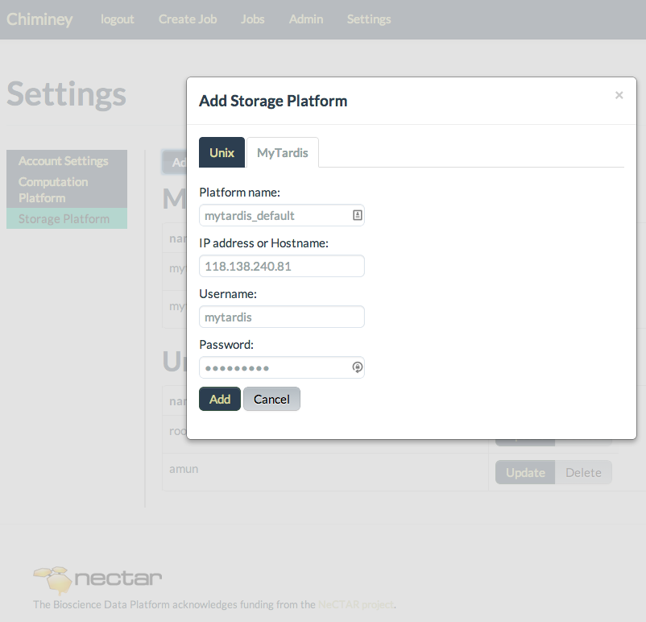

    Figure.  Adding MyTardis-based storage platform

.. _update_platform:

Updating Computation/Storage Platform
^^^^^^^^^^^^^^^^^^^^^^^^^^^^^^^^^^^^^

1. Navigate to the Chiminey server homepage
2. Log in with credentials
3. Click ``Settings``
4. To update a computation platform, click ``Computation Platform`` whereas to update a storage platform, click ‘Storage Platform’ from the ``Settings`` menu.
5. Locate the platform you wish to update, then click ``Update``
6. Make the changes, and when finished click ``Update``

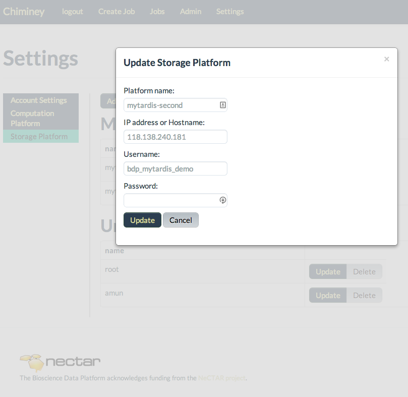

    Figure.  Updating a platform

.. _delete_platform:

Deleting Computation/Storage Platform
^^^^^^^^^^^^^^^^^^^^^^^^^^^^^^^^^^^^^

1. Navigate to the the Chiminey server homepage
2. Log in with credentials
3. Click ``Settings``
4. To delete a computation platform, click ``Computation Platform`` whereas to delete a storage platform, click ``Storage Platform`` from the ‘Settings’ menu.
5. Locate the platform you wish to delete, then click Delete
6. All the contents of the platform will be shown on a dialogue box. If you want to continue deleting the platform, click ``Delete``. Otherwise, click ``Cancel``

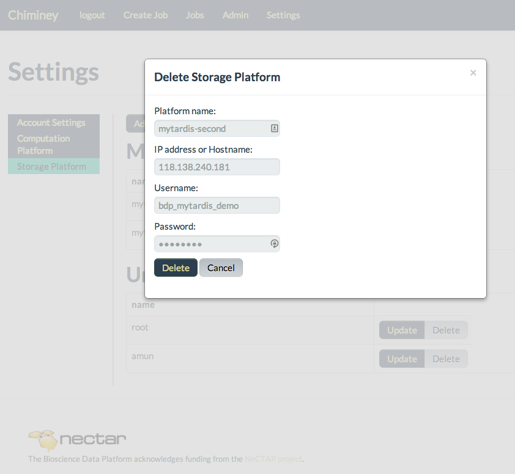

    Figure.  Deleting a platform

.. _submit_job:

Job Submission
--------------

Follow the steps below

1. Navigate to the Chiminey server homepage
2. Log in with credentials
3. Click ``Create Job`` from the menu bar
4. Select the smart connector from the list of smart connectors
5. Enter the values for the parameters of the selected smart connector. Parameters of any smart connector fall into either of the following types: *Computation platform, Cloud resource, Location, Reliability, MyTardis, Parameter Sweep* and  *Domain-specific*. See :ref:`form_field_types` for detailed discussion about these parameter types.
6. Click ``Submit Job`` button, then ``OK``

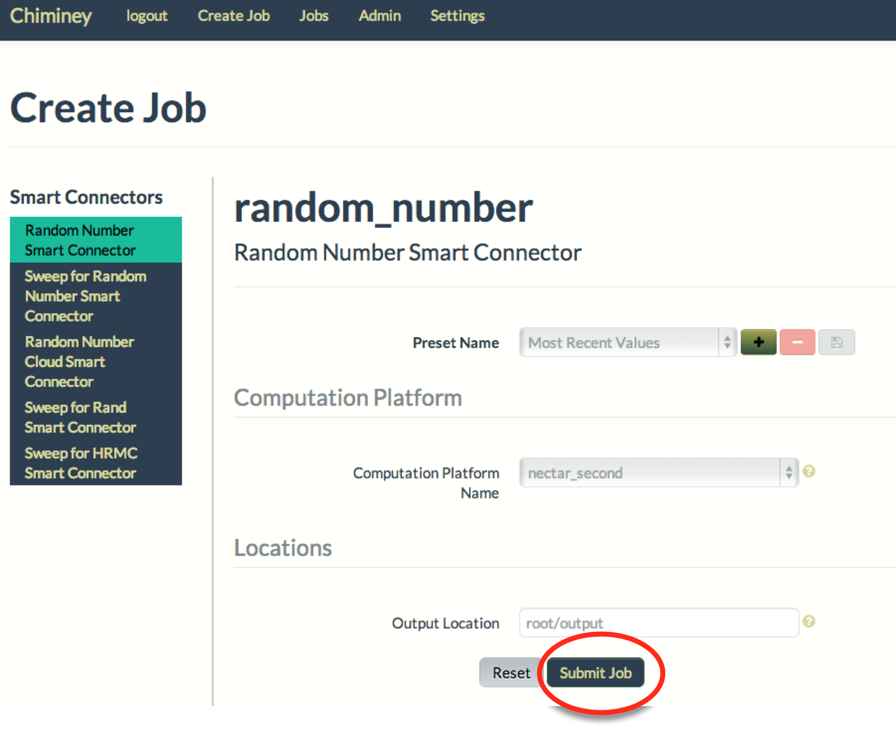

    Figure.  Submitting a job

.. _monitor_job:

Job Monitoring
--------------

Once a job is submitted, the end-user can monitor the status of the job.

1. Submit a job (see :ref:`submit_job`)
2. Click ``Jobs``. A job status summary of all jobs will be displayed. The most recently submitted job is displayed at the top.
3. Click ``Info`` button next to each job to view a detailed status report.
4. A job is completed when the ``Iteration:Current`` column of ``Jobs`` page displays  ``x: finished``, where ``x`` is the last iteration number.

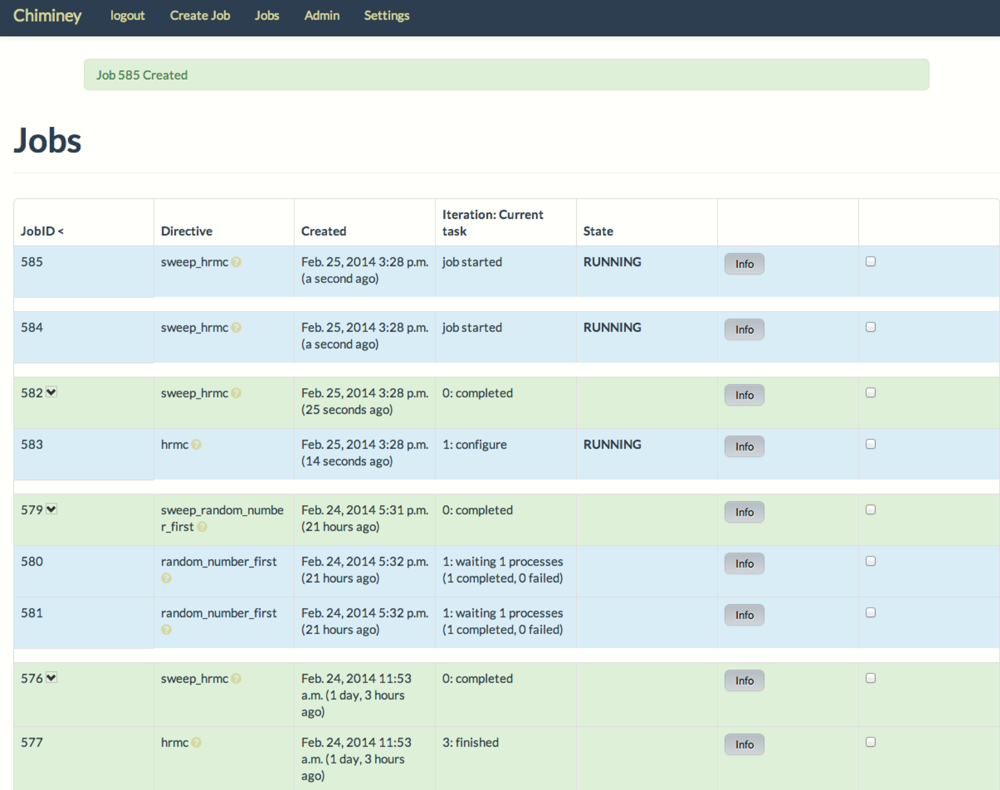

    Figure.  Monitoring a job

.. _terminate_job:

Job Termination
---------------

The end-user can terminate already submitted jobs.

1. Submit a job (see :ref:`submit_job`)
2. Click ``Jobs`` to view all submitted jobs.
3. Check the box at the end of the status summary of each job that you wish terminate.
4. Click ``Terminate selected jobs`` button. The termination of the
   selected jobs will be scheduled. Depending on the current
   activity of each job, terminating one job may take longer than
   the other.

.. figure:: img/enduser_manual/terminate.png
    :align: center
    :alt:   Terminating a job
    :figclass: align-center

    Figure.  Terminating a job

.. _manage_presets:

Presets Management
------------------

The end-user can save the set of parameters values of a job as a preset.
Each preset must have a unique name. Using the unique preset name, the
end-user can retrieve, update and delete saved presets.

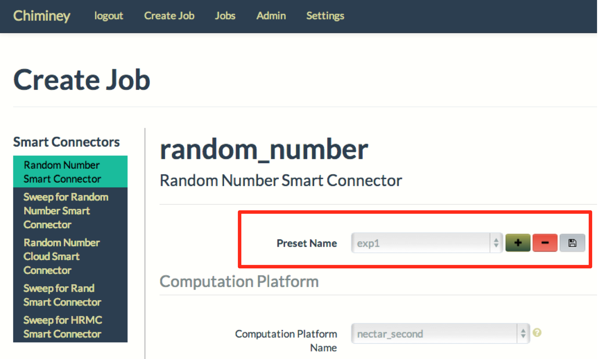

    Figure.  Managing presets

Adding Preset
^^^^^^^^^^^^^

1. Fill the parameter values for the job you are about to submit
2. Click **+** button next to the ``Preset Name`` drop down menu
3. Enter a unique name for the new preset
4. Click ``Add``

Retrieving Preset
^^^^^^^^^^^^^^^^^

1. Select the preset name from the ``Preset Name`` drop down menu. The
   parameters on the submit job will be filled using parameters
   values that are retrieved from the selected preset.

Updating Preset
^^^^^^^^^^^^^^^

1. Select the preset name from the 'Preset Name' drop down menu.
2. Change the value of parameters as needed
3. Save your changes by clicking  the save button next to the ``Preset Name`` drop down menu.

Deleting Preset
^^^^^^^^^^^^^^^

1. Select the preset name from the ``Preset Name`` drop down menu.
2. Click **-** button next to the 'Preset Name' drop down
   menu. Then, confirmation box appears.
3. Click ``OK`` to confirm.