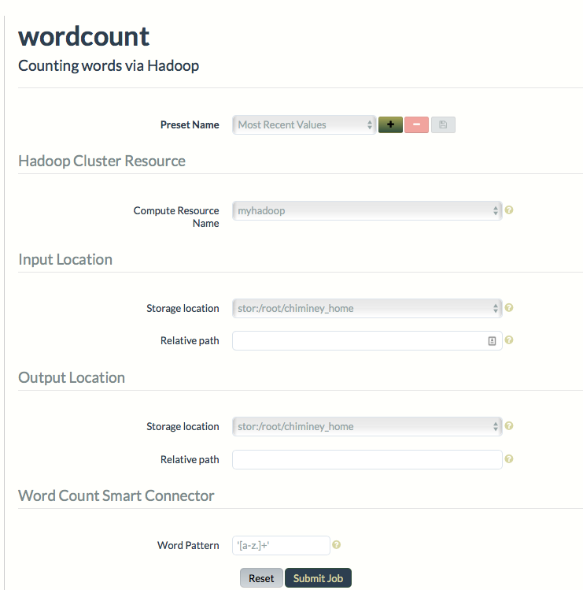

.. _manage_job:

Job Management
==============

The end-user  :ref:`submits <submit_job>`, :ref:`monitors <monitor_job>`, and :ref:`terminates <terminate_job>` jobs via the Chiminey portal. Before going into details about job management, we first discuss the :ref:`Chiminey UI <chiminey_ui>` for submitting jobs.

.. _chiminey_ui:

The Job Submission UI
--------------

    Figure. Job Submission UI for wordcount smart connector

The aim of the following discussion is to understand the job submission UI, and therefore be able to run any smart connector job without difficulty.
The job submission UI is accessed by clicking ``Create Job`` tab. The above figure shows the job submission UI of `wordcount` smart connector.
The Chiminey job submission UI is composed of a list of activated smart connectors, and the submission form of the selected smart connector.
The submission form is divided into various sections. In general, each submission form has at least three sections: :ref:`presets_ui`, :ref:`compute_resource_ui` and :ref:`locations_ui`.

.. _presets_ui:

1. Presets
~~~~~~~~~~~~

The end-user can save the set of parameters values of a job as a preset. Each preset must have a unique name. Using the unique preset name, the end-user can retrieve, update and delete saved presets.

.. _compute_resource_ui:

2. Compute Resource
~~~~~~~~~~~~~~~~~~~~~~~~

This section includes the parameters that are needed to utilise the compute resource associated with the given smart connector. For instance, hadoop compute resources need only the name of the registered hadoop cluster (see :ref:`analytics_resource`), while the cloud compute resource needs the resource name as well as the total VMs that can be used for the computation. Note that the names of all registered compute resources are automatically populated to a dropdown menu on the submission form.

.. _locations_ui:

3. Locations
~~~~~~~~~~~~

These parameters are used to specify either input or output directories on a registered storage resource. Each location consists of two parameters: a storage location and a relative path. ``Storage location``
is a drop-down menu that lists the name of all registered storages and, their corresponding root path. A `root path` is an absolute path to the directory on the storage resource onto which all
input and output files will be saved. ``Relative path`` is the name of a subdirectory of the root path that contains input and/or output files. In the case of input locations, Chiminey retrieves the input files that
are needed to run the smart connector job from this subdirectory. In the case of output location, Chiminey will save the output of the smart connector job to the subdirectory.

.. _optional_sections_ui:

4. Optional Parameter Sections
~~~~~~~~~~~~

Some job submission forms include one or more of the following sections:

Reliability
********

 Fault tolerance support is provided to each smart connector job. How- ever, the enduser can limit the degree of such support using the reliability parameters: reschedule failed processes and maximum retries.

Sweep
*****

 Sweep allows end-users to run multiple jobs simultaneously from a single submission. The sweep allows end-users to provide ranges of input values for parameters,
 and the resulting set of jobs produced span all possible values within that parameter space. These ranges of parameters are defined at job submission time, rather than being hard-coded in the definition of the smart connector. The common use- cases for this feature are to generate multiple results across one or more variation ranges for later comparison, and to quickly perform experi- mental or ad-hoc variations on existing connectors. Endusers specify the parameter(s) and their possible values via the sweep parameter.

Data curation resource
*************

 This section provides the parameters that are needed to curate the output of a smart connector job. The section includes a drop- down menu that is populated with the name registered data curation services like MyTardis.

Domain-specific parameters
*************

 These parameters are needed to guide the execution of the domain-specific payload of a given smart connector. wordcount smart connector has `Word Pattern` while hrmclite  has `pottype`, `error threshold`, and others.

.. _submit_job:

Job Submission
--------------

Follow the steps below

#. Navigate to the Chiminey portal
#. Log in with your credentials
#. Click ``Create Job`` from the menu bar
#. Select the smart connector from the list of smart connectors
#. Enter the values for the parameters of the selected smart connector.
#. Click ``Submit Job`` button, then ``OK``

..
  .. figure:: img/enduser_manual/submit.png
      :align: center
      :alt:   Submitting a job
      :figclass: align-center

      Figure.  Submitting a job

.. _monitor_job:

Job Monitoring
--------------

Once a job is submitted, the end-user can monitor the status of the job by clicking ``Jobs tab``. A job status summary of all jobs will be displayed.
The most recently submitted job is displayed at the top. Click ``Info`` button next to each job to view a detailed status report.

.. figure:: img/enduser_manual/monitor.png
    :align: center
    :alt:   Monitoring a job
    :figclass: align-center

    Figure.  Monitoring a job

.. _terminate_job:

Job Termination
---------------

The `Jobs` page also allows to terminate submitted jobs. To terminate a job, check the box at the end of the status summary of the job,
click ``Terminate selected jobs`` button at the end of the page. The termination of the selected jobs will be scheduled.
Depending on the current activity of each job, terminating one job may take longer than the other.

.. figure:: img/enduser_manual/terminate.png
    :align: center
    :alt:   Terminating a job
    :figclass: align-center

    Figure.  Terminating a job
