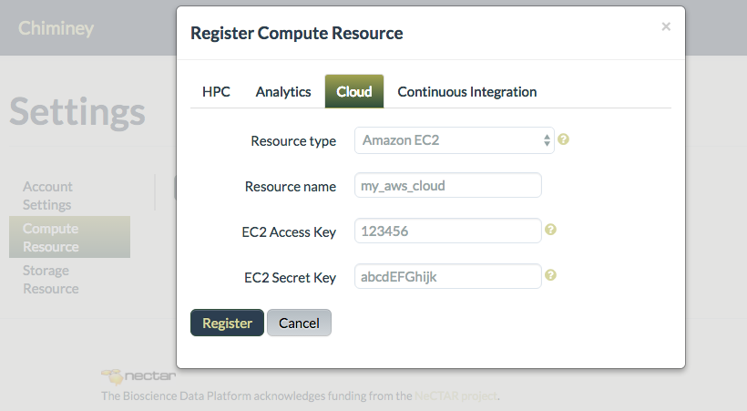
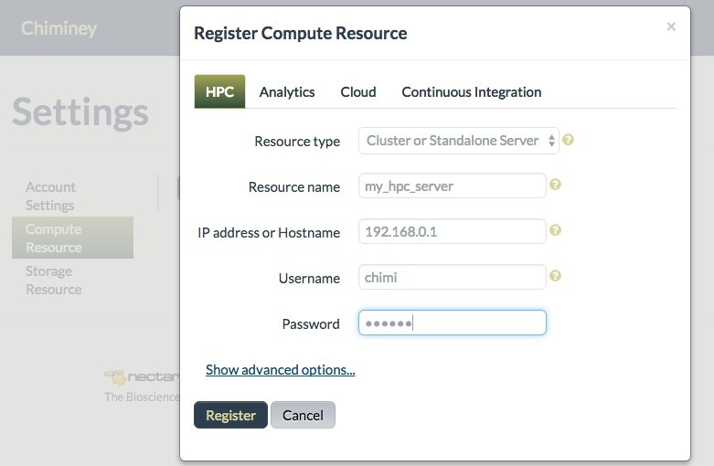
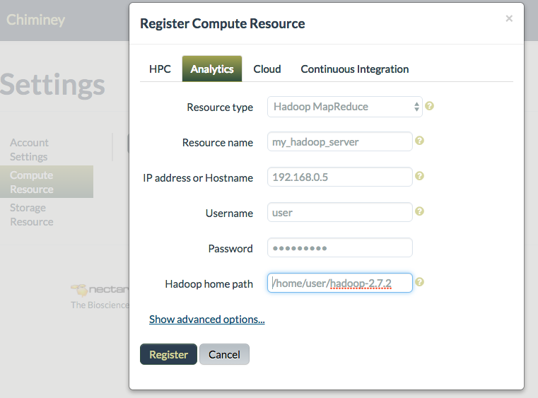
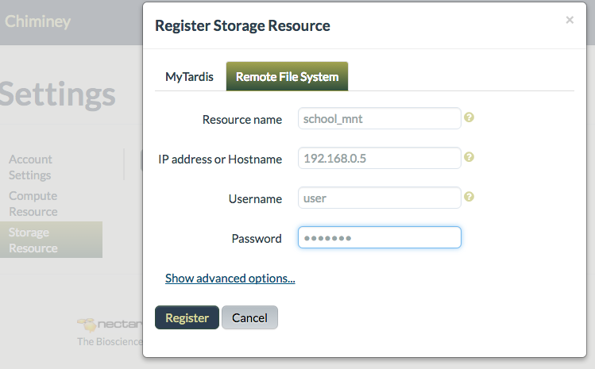
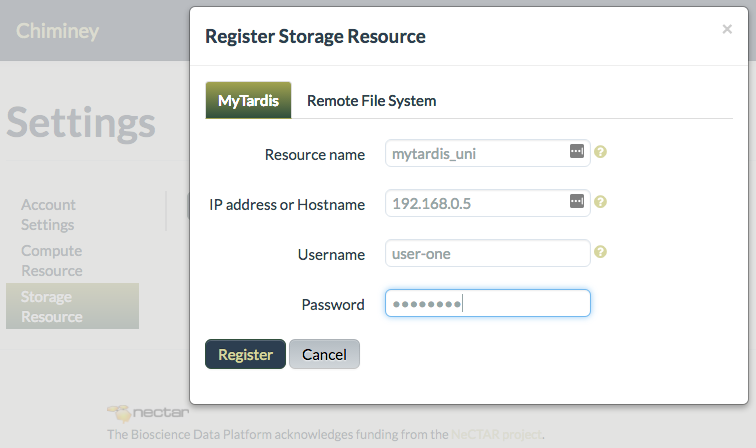

.. _configure_resource_settings:

Resource  Management
===============================

A Chiminey platform  supports access to computation and
storage resources. A computation resource is where the core functionality of a
smart connector is executed while a storage resource is used to retrieve input files and store output files.
 Prior to submitting a job, end-users need
to register at least one computation and one storage resources. In this
section, following topics are covered:

-  :ref:`register_computation_resource`
-  :ref:`register_storage_resource`
-  :ref:`update_resource`
-  :ref:`remove_resource`

.. _register_computation_resource:

Registering Compute Resources
----------------------------

Various computing infrastructure and tools can be registered as compute resources. These resources are broadly categorised under :ref:`cloud <cloud_resource>`, :ref:`high performance computing (HPC) <hpc_resource>`,
:ref:`analytics <analytics_resource>`,  and continuous integration resources.

.. _cloud_resource:

Cloud Compute Resource
^^^^^^^^^^^^^^^^^^^^^^^^^^

#.  Navigate to the Chiminey portal.
#.  Log in with your credentials.
#.  Click ``Settings``.
#.  Click ``Compute Resource`` from the ``Settings`` menu.
#.  Click ``Register Compute Resource``
#.  Click the ``Cloud`` tab.
#.  Select the resource type from the drop down menu. You may have  access to more than one type of cloud service, e.g., NeCTAR and Amazon.
#.  Enter a unique resource name.
#.  Enter credentials such as EC2 access key and EC2 secret key
#.  Click ``Register``. The newly registered  cloud-based compute resource will be displayed under `Cloud - NeCTAR/CSRack/Amazon EC2`.

    Figure. Registering a cloud-based compute resource

.. _hpc_resource:

HPC Compute Resource
^^^^^^^^^^^^^^^^^^^^^^^^^^^^^^^^^^

#.  Navigate to the Chiminey portal.
#.  Log in with your credentials.
#.  Click ``Settings``.
#.  Click ``Compute Resource`` from the ``Settings`` menu.
#.  Click ``Register Compute Resource``
#.  Click the ``HPC`` tab.
#.  Enter a unique resource name.
#.  Enter IP address or hostname of the HPC cluster head node or the standalone server.
#.  Enter credentials, i.e. username and password. Password is not stored in the Chiminey platform. It is temporarily kept in memory to establish a private/public key authentication from the Chiminey platform to the resource.
#.  Click ``Register``.  The newly registered resource will be displayed under `HPC - Cluster or Standalone Server` list.

    Figure. Registering a HPC compute resource

.. _analytics_resource:

Analytics Compute Resource
^^^^^^^^^^^^^^^^^^^^^^^^^^^^^^^^^^

#.  Navigate to the Chiminey portal.
#.  Log in with your credentials.
#.  Click ``Settings``.
#.  Click ``Compute Resource`` from the ``Settings`` menu.
#.  Click ``Register Compute Resource``
#.  Click the ``Analytics`` tab.
#.  Select ``Hadoop MapReduce`` as the resource type from the drop down menu.
#.  Enter a unique resource name.
#.  Enter IP address or hostname of the Hadoop MapReduce resource.
#.  Enter username and password. Password is not stored in the Chiminey platform. It is temporarily kept in memory to establish a private/public key authentication from the Chiminey platform to the resource.
#.  Click ``Register``.  The newly registered resource will be displayed under `Analytics - Hadoop MapReduce` list.

    Figure. Registering an analytics compute resource (Hadoop MapReduce)

.. _register_storage_resource:

Registering Storage Resources
----------------------------

:ref:`Remote file systems <remote_storage>` and data curation services like :ref:`Mytardis  mytardis_storage` are used as a storage resources.

.. _remote_storage:

Remote File System
^^^^^^^^^^^^^^^^^^^^^

#.  Navigate to the Chiminey portal.
#.  Log in with your credentials.
#.  Click ``Settings``.
#.  Click ``Storage Resource`` from the ``Settings`` menu.
#.  Click ``Register Storage Resource``
#.  Click the ``Remote File System`` tab.
#.  Enter a unique resource name.
#.  Enter IP address or hostname of the remote file system.
#.  Enter credentials, i.e. username and password. Password is not stored in the Chiminey platform. It is temporarily kept in memory to establish a private/public key authentication from the Chiminey platform to the resource.
#.  Click ``Register``.  The newly registered resource will be displayed under `Remote File System` list.

    Figure. Registering a remote file system as a storage resource

.. _mytardis_storage:

MyTardis Storage Resource
^^^^^^^^^^^^^^^^^^^^^^^^^

#.  Navigate to the Chiminey portal.
#.  Log in with credentials
#.  Click ``Settings``
#.  Click ``Storage Resource`` from the ``Settings`` menu
#.  Click ``Register Storage Resource``
#.  Click the ``MyTardis`` tab.
#.  Enter a unique resource name.
#.  Enter IP address or hostname of the MyTardis instance.
#.  Enter credentials, i.e. username and password. Username and password are stored on the Chiminey platform.
#. Click ``Register``. The newly registered storage resource will be displayed under `MyTardis` list.

    Figure.  Registering MyTardis, a data curation service.

.. _update_resource:

Updating Resources
--------------------
 Follow the steps below to change he details of registered resources.

#. Navigate to the Chiminey portal.
#. Log in with credentials
#. Click ``Settings``
#. From the ``Settings`` menu, depending on which resource you wish to update, click either `Compute Resource` or `Storage Resource`. All registered resources will be listed.
#. Locate the resource you wish to update, then click `Update`.
#. Make the changes, and when finished click ``Update``

..
  .. figure:: img/enduser_manual/update_platform.png
      :align: center
      :alt:  Updating a platform
      :figclass: align-center

      Figure.  Updating a platform

.. _remove_resource:

Removing Resources
-------------------

In order to remove a registered resource, follow all the steps from :ref:`update_resource` but click `Remove` instead of `Update`. The resource will be removed from the resources’ list.

..
  .. figure:: img/enduser_manual/delete_platform.png
      :align: center
      :alt:  Deleting a platform
      :figclass: align-center

      Figure.  Deleting a platform
