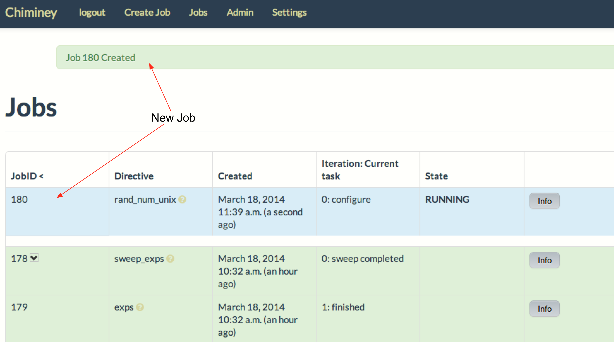
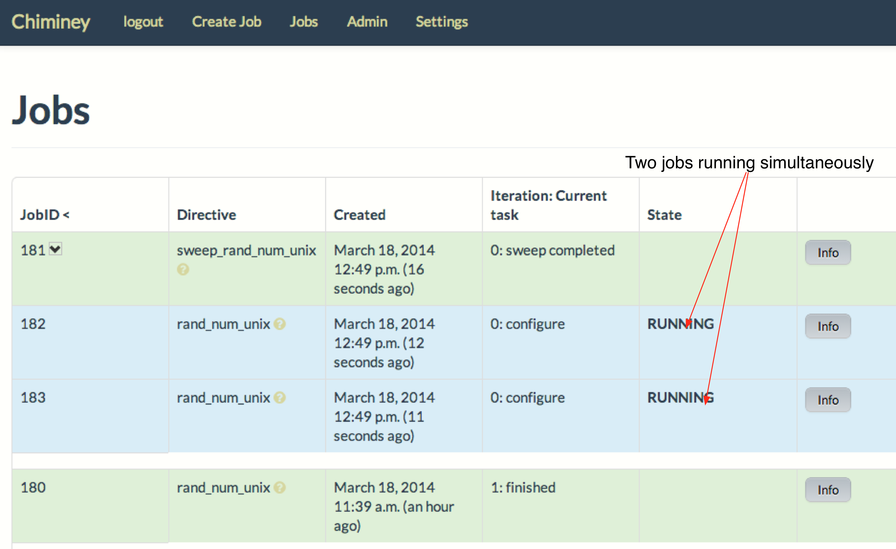

.. _quick_example:

========================================================================
Quick Example: The Unix Random Number Smart Connector
========================================================================

In this example, we create a basic smart connector that generates two
random numbers on a unix machine (or the Chiminey server machine,
for simplicity), saves the numbers to a file, and then transfers the file
to a provided output location. This smart connector will be known as the
Unix Random Number Smart Connector.

**NB:** The source code for this example is available at ``chiminey/examples/randnumunix``.

Requirements
------------

1. Installation and configuration of the Chiminey server on a virtual machine,
   according to the :ref:`Installation Guide <installation_guide>`.
2. Registration of a computation platform, which is where the core
   functionality of a smart connector is executed within the Chiminey
   UI. For this example, the platform could be any unix server,
   including the Chiminey server itself. (see registering :ref:`Cluster/Unix  Computation Platform <cluster_unix_platform>`).
3. Registration of a storage platform, which is the destination of the
   smart connector output within the Chiminey UI. As for the computation
   platform above, the platform could be any unix server, again
   including the Chiminey server itself. (see registering :ref:`Unix Storage Platform <unix_storage_platform>`).

Creating the Unix Random Number Smart Connector
------------------------------------------

Here, we a create the unix random number :ref:`smart connector <smart_connector_desc>`.
For that, we need to carry out the following steps, in order:

1. :ref:`customise <customize_execute_stage>`  the execute stage,
2. :ref:`define <define_unix_randnum_conn>`  the smart connector with the new
   execute stage and the pre-defined core stages, and
3. :ref:`register  <register_smart_conn>` the smart connector within
   Chiminey so it can be executed.
4. In this example, we also show how to add a :ref:`sweep functionality <sweep>`  to a smart connector .

.. _customize_execute_stage:

I. Customizing the Execute Stage
~~~~~~~~~~~~~~~~~~~~~~~~~~~~~~~~

The customised execute stage, i.e., ``RandExecute``, is available at ``chiminey/examples/randnumunix/randexexute.py``.

1. ``RandExecute`` subclasses the core execute stage ``Execute``, which is located at ``chiminey/corestages/execute.py``. ``RandExecute`` overwrites ``def run_task(self, ....)`` to include the code that generates the random numbers (NB: ``def run_task(self, ....)`` does nothing by default)

2. Here is the code that generates two random numbers: ``python -c 'import random; print random.random()'``

3. Chimney  expects the output of a computation to be in a specific location.  Therefore, ``get_process_output_path(...)`` is used to retrieve the path to which the output of your computation should be sent. For this example, this path is not create automatically by Chiminey, therefore must be created prior to generating random numbers.

4. We then use ``run_command(...)``, which is a compute API, to make the output directory and then generate and save the two random numbers

Below is the content of the ``RandExecute`` class:

::

    from chiminey.corestages import Execute
    from chiminey.compute import run_command

    class RandExecute(Execute):
        def run_task(self, ip_address, process_id, connection_settings, run_settings):
            filename = 'rand'
            output_path = self.get_process_output_path(
                run_settings, process_id, connection_settings)
            command = "mkdir -p %s; cd %s ; python -c 'import random;"\
                "print random.random()' > %s" \
                % (output_path, output_path, filename)
            output, err = run_command(command, ip_address,connection_settings)

.. _define_unix_randnum_conn:

II. Defining the Unix Random Number Smart Connector
~~~~~~~~~~~~~~~~~~~~~~~~~~~~~~~~~~~~~~~~~~~~~~~~~~~
The new  definition of this smart connector, i.e., ``RandInitial``, is available at ``chiminey/examples/randnumunix/initialise.py``

1. ``RandInitial`` subclasses ``CoreInitial``, which is located at ``chiminey/initialise/coreinitial.py``.  ``RandInitial``  overwrites ``get_updated_execute_params(self)`` and  ``get_ui_schema_namespace(self)``.

2. In the :ref:`previous step  <customize_execute_stage>`, the execute stage is customised. Therefore, ``get_updated_execute_params(self)`` updates the package path  to point to the customised execute stage class, which is
    ``chiminey.examples.randnumunix.randexexute.RandExecute``.

3. The new ``get_ui_schema_namespace(self)`` contains two schema namespaces that represent two types of input fields:

    a. *RMIT_SCHEMA + "/input/system/compplatform"* for specifying the name of the `computation platform <https://github.com/chiminey/chiminey/wiki/Types-of-Input-Form-Fields#computation_platform>`__, and
    b. *RMIT_SCHEMA + "/input/location/output"* for specifying the `output location <https://github.com/chiminey/chiminey/wiki/Types-of-Input-Form-Fields#location>`__.

Below is the content of ``RandInitial``.

::

    import logging
    from chiminey.initialisation import CoreInitial

    logger = logging.getLogger(__name__)
    class RandInitial(CoreInitial):
        def get_updated_execute_params(self):
            return {'package': "chiminey.examples.randnumunix.randexecute.RandExecute"}

        def get_ui_schema_namespace(self):
            RMIT_SCHEMA = "http://rmit.edu.au/schemas"
            schemas = [
                    RMIT_SCHEMA + "/input/system/compplatform",
                    RMIT_SCHEMA + "/input/location/output",
                    ]
            return schemas

.. _register_smart_conn:

III. Registering the Unix Random Number Smart Connector within Chiminey
~~~~~~~~~~~~~~~~~~~~~~~~~~~~~~~~~~~~~~~~~~~~~~~~~~~~~~~~~~~~~~~~~~~~~~~

A smart connector can be registered within the Chiminey server in various ways. Here, a `Django management command <https://docs.djangoproject.com/en/dev/howto/custom-management-commands/#management-commands-and-locales>`__ is used. ``chiminey/smartconnectorscheduler/management/commands/randnumunix.py`` contains the Django management command for registering the unix random number smart connector. Below is the full content.

::

    from django.core.management.base import BaseCommand
    from chiminey.examples.randnumunix.initialise import RandInitial

    MESSAGE = "This will add a new directive to the catalogue of available connectors.  Are you sure [Yes/No]?"

    class Command(BaseCommand):
        """
        Load up the initial state of the database (replaces use of
        fixtures).  Assumes specific structure.
        """
        args = ''
        help = 'Setup an initial task structure.'
        def setup(self):
            confirm = raw_input(MESSAGE)
            if confirm != "Yes":
                print "action aborted by user"
                return

            directive = RandInitial()
            directive.define_directive('rand_num_unix', description='RandNum Unix Smart Connector')
            print "done"

        def handle(self, *args, **options):
            self.setup()
            print "done"

1. When registering a smart connector, a unique name must be provided. In this case, *rand_num_unix*. If a smart connector exists with the same name, the command will be ignored.

2. A short description is also needed. In this case, *RandNum Unix Smart Connector*.  Both the unique name and the description will be displayed on the Chiminey UI.

3. Execute the following commands on the Chiminey server terminal

::

    cd /opt/chiminey/current
    sudo su bdphpc
    bin/django randnumunix
    Yes

4. Visit your Chiminey web page Click ``Create Job``. You should see ``RandNum Unix Smart Connector`` under ``Smart Connectors`` menu.

    Figure. The Unix Random Number Smart Connector

.. _test_randnumunix:

Testing the Unix Random Number Smart Connector
""""""""""""""""""""""""""""""""""""""""""""""

Now, test the correct definition and registration of the
unix random number smart connector.  For this, you will :ref:`submit  <test_submit_job>` a unix random number smart connector job,
:ref:`monitor <test_monitor_job>`  the job,
and :ref:`view <test_view_output>` the output of the job.

.. _test_submit_job:

Submit a unix random number smart connector job
'''''''''''''''''''''''''''''''''''''''''''''''

See :ref:`Job Submission <submit_job>` for details.

    Figure. A unix random number smart connector job

.. _test_monitor_job:

Monitor the progress of the job
'''''''''''''''''''''''''''''''''''''''''''''''

See :ref:`Job Monitoring <monitor_job>` for details.

    Figure. The unix random number smart connector job is completed

.. _test_view_output:

View job output
'''''''''''''''

When the job is completed, view the two generated random numbers

    a. Login to your storage platform
    b. Change directory to the root path of your storage platform
    c. The output is located under *smart_connector_uniquenameJOBID*, e.g. rand_num_unix180

.. _sweep:

IV. Parameter Sweep for the Unix  Random Number Smart Connector
~~~~~~~~~~~~~~~~~~~~~~~~~~~~~~~~~~~~~~~~~~~~~~~~~~~~~~~~~~~~~~~

Parameter sweep is used to create multiple jobs, each with its set of
parameter values (see `Parameter
Sweep <https://github.com/chiminey/chiminey/wiki/Types-of-Input-Form-Fields#sweep>`__
for details). This feature can be added to a smart connector by turning
the sweep flag on during the `registration of the smart
connector <#register_smart_conn>`__.

1. Add ``sweep=True`` parameter when you call ``define_directive(...)``. Below is the code snippet from the Django management command:

::

    class Command(BaseCommand)
    ...

    def setup(self):
        ...

        directive = RandInitial()
        directive.define_directive('rand_num_unix', description='RandNum Unix Smart Connector', sweep=True)
        print "done"

2. Re-execute the following commands on the Chiminey server terminal

::

    cd /opt/chiminey/current
    sudo su bdphpc
    bin/django randnumunix
    Yes

3. Visit your Chiminey web page; Click ``Create Job``. You should see ``Sweep RandNum Unix Smart Connector`` under ``Smart Connectors`` menu.

    Figure. The Sweep Unix Random Number Smart Connector

Testing the Sweep Unix Random Number Smart Connector
""""""""""""""""""""""""""""""""""""""""""""""""""""

Similar to our :ref:`previous test <test_randnumunix>`, we  test
the newly registered smart connector.
 For this, you will :ref:`submit  <test_submit_sweepjob>` a *sweep* for unix random number smart connector job,
:ref:`monitor <test_monitor_sweepjob>`  the job,
and :ref:`view <test_view_sweepoutput>` the output of the job.

.. _test_submit_sweepjob:

Submit a sweep for unix random number smart connector job
'''''''''''''''''''''''''''''''''''''''''''''''''''''''''

See :ref:`Job Submission <submit_job>` for details.

**NB**: If you leave ``Values to sweep over`` field empty, only a single job will be created. In this case,  put
  ``{"var": [1,2]}`` to create two jobs. See `Parameter Sweep <https://github.com/chiminey/chiminey/wiki/Types-of-Input-Form-Fields#sweep>`__ for details

.. _test_monitor_sweepjob:

Monitor the progress of the job
'''''''''''''''''''''''''''''''

See :ref:`Job Monitoring <monitor_job>` for details.

    Figure. The unix random number smart connector job is completed

.. _test_view_sweepoutput:

View job output
'''''''''''''''

When the job is completed, view the two generated random numbers

    a. Login to your storage platform
    b. Change directory to the root path of your storage platform
    c. The output is located under *sweep_smart_connector_nameJOBID*, e.g. sweep_rand_num_unix181
