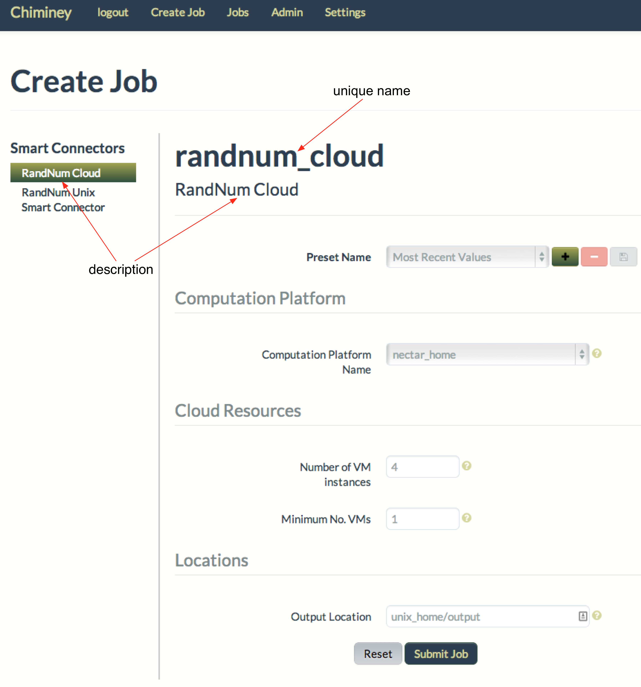
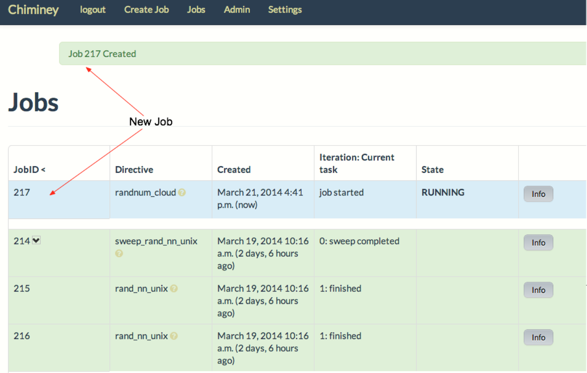
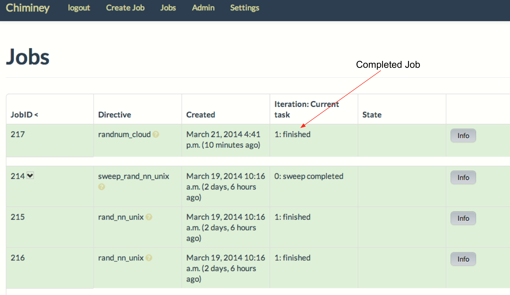

    .. _cloud: http://aws.amazon.com/what-is-cloud-computing/

=======================================
The Cloud Random Number Smart Connector
=======================================

In this example, we create a  smart connector that generates a pair of random numbers on the cloud_.
We call this smart connector the *cloud random number smart connector*. This smart
connector creates a virtual machine (VM),
executes a number generator on the VM to produce two random numbers,
and then transfers  the file that contains the random numbers to a user-designated
location.

    - The **purpose** of this example is to create a smart connector that executes programs on the cloud_.

    - The **source code** for this example is available at ``chiminey/examples/randnumcloud``.

    - To add **parameter sweep** to this smart connector, see :ref:`quick example <sweep>`.

Requirements
------------

1. Installation and configuration of the Chiminey server on a virtual machine,
   according to the :ref:`Installation Guide <installation_guide>`.
2. Registration of a cloud computation platform, which is where the core
   functionality of a smart connector is executed within the Chiminey
   UI. For this example, the platform could be any unix server,
   including the Chiminey server itself. (see registering :ref:`Cloud Computation Platform <cloud_platform>`).
3. Registration of a storage platform, which is the destination of the
   smart connector output within the Chiminey UI. As with other storage
   platforms, the platform could be any unix server, again
   including the Chiminey server itself. (see registering :ref:`Unix Storage Platform <unix_storage_platform>`).

Creating the Cloud Random Number Smart Connector
------------------------------------------------
Here, we a create the cloud random number :ref:`smart connector <smart_connector_desc>`.
For this, we need to carry out the following steps, in order:

1. :ref:`prepare <prepare_payload_cloud>` a payload

2. :ref:`define <define_cloud_randnum_conn>`  the smart connector using the pre-defined core stages, and

3. :ref:`register  <register_smart_conn_cloud>` the smart connector within Chiminey so it can be executed.

.. _prepare_payload_cloud:

I. Preparing a Payload
~~~~~~~~~~~~~~~~~~~~~~

We now discuss how to prepare a :ref:`payload <payload>` for the cloud random number smart connector.
This step is required because the computation platform of this smart connector is
a cloud infrastructure and :ref:`all cloud-based smart connectors must include their domain-specific executables in a payload <payload>`.

**NB:** The payload for the cloud random number smart connector is available at ``chiminey/examples/randnumcloud/payload_randnum``.

1. The Chiminey server expects  payloads to be under ``LOCAL_FILESYS_ROOT_PATH``, which is ``/var/chiminey/remotesys`` by default. A subdirectory can be created under ``LOCAL_FILESYS_ROOT_PATH`` to better organise payloads. On such occasions,  :ref:`the Chiminey server must be configured to point to the subdirectory <define_cloud_randnum_conn>`. Let's now  create a subdirectory ``my_payloads``, and then put ``payload_randnum`` under it.

 ::

   mkdir -p /var/chiminey/remotesys/my_payloads
   cp -r  /opt/chiminey/current/chiminey/examples/randnumcloud/payload_randnum /var/chiminey/remotesys/my_payloads/

2. As recommended in :ref:`payload <payload>`, ``payload_template`` is used as the starting point to prepare ``payload_randnum``. In order to satisfy  The system file that is changed is  ``start_running_process.sh``.

    a. ``start_running_process.sh`` includes  the logic for generating the random numbers. As expected by the Chiminey server, the output of the program is redirected to ``chiminey``. Since this random generator is synchronous, the process ID is not  saved. Here is the content of ``start_running_process.sh``:

     ::

        #!/bin/sh

        python -c 'import random;  print random.random(); print random.random()'  >& chiminey/rand

    b. ``process_running_done.sh`` remains the same because the random number generating program is synchronous.

    c. ``start_bootstrap.sh`` and ``bootstrap_done.sh`` remain the same. This is because the random number  generation depends only on ``python``, and the  included ``python`` in  linux-based OS  fulfills the requirement.

    d. ``start_process_schedule.sh`` and  ``start_running_process.sh`` remain the same because there is no process-level configuration requirement.

.. _define_cloud_randnum_conn:

II. Defining the Cloud Random Number Smart Connector
~~~~~~~~~~~~~~~~~~~~~~~~~~~~~~~~~~~~~~~~~~~~~~~~~~~~

The   definition of this smart connector, i.e., ``RandNumCloudInitial``, is available at ``chiminey/examples/randnumcloud/initialise.py``.

1. ``RandNumCloudInitial`` subclasses ``CoreInitial``, which is located at ``chiminey/initialise/coreinitial.py``.  ``RandNumCloudInitial``  overwrites ``get_updated_bootstrap_params(self)`` and  ``get_ui_schema_namespace(self)``.

2.  ``get_updated_bootstrap_params(self)`` updates settings to point the Chiminey server to the location of  the new payload. The location of any payload is given relative to ``LOCAL_FILESYS_ROOT_PATH``. Since we :ref:`previously <prepare_payload_cloud>`  copied ``payload_randnum`` to  ``LOCAL_FILESYS_ROOT_PATH/my_payloads/payload_randnum``, the location of the payload is ``my_payloads/payload_randnum``.

3. The new ``get_ui_schema_namespace(self)`` contains three schema namespaces that represent three types of input fields for specifying the name of a cloud-based computation platform, the maximum and minimum number of VMs  needed for the job, and an output location (see :ref:`smart_connector_ui`).

Below is the content of ``RandNumCloudInitial``.

::

    from chiminey.initialisation import CoreInitial

    class RandNumCloudInitial(CoreInitial):
        def get_updated_bootstrap_params(self):
            settings = {
                    u'http://rmit.edu.au/schemas/stages/setup':
                        {
                            u'payload_source': 'my_payloads/payload_randnum',
                        },
                }
            return {'settings': settings}

        def get_ui_schema_namespace(self):
            RMIT_SCHEMA = "http://rmit.edu.au/schemas"
            schemas = [
                    RMIT_SCHEMA + "/input/system/compplatform/cloud",
                    RMIT_SCHEMA + "/input/system/cloud",
                    RMIT_SCHEMA + "/input/location/output",
                    ]
            return schemas

.. _register_smart_conn_cloud:

III. Registering the Cloud Random Number Smart Connector within Chiminey
~~~~~~~~~~~~~~~~~~~~~~~~~~~~~~~~~~~~~~~~~~~~~~~~~~~~~~~~~~~~~~~~~~~~~~~~

A smart connector can be registered within the Chiminey server in various ways. Here,
a `Django management command <https://docs.djangoproject.com/en/dev/howto/custom-management-commands/#management-commands-and-locales>`__ is used.
``chiminey/smartconnectorscheduler/management/commands/randnumcloud.py`` contains the Django management command for registering the cloud
random number smart connector.

1. When registering a smart connector, a **unique name** must be provided. In this case, *randnum_cloud*. If a smart connector exists with the same name, the command will be ignored.

2. A short **description** is also needed. In this case, *RandNum Cloud*.  Both the unique name and the description will be displayed on the Chiminey UI.

::

    from django.core.management.base import BaseCommand
    from chiminey.examples.randnumcloud.initialise import RandNumCloudInitial

    MESSAGE = "This will add a new directive to the catalogue of available connectors.  Are you sure [Yes/No]?"

    class Command(BaseCommand):
        """
        Load up the initial state of the database (replaces use of
        fixtures).  Assumes specific structure.
        """

        args = ''
        help = 'Setup an initial task structure.'

        def setup(self):
            confirm = raw_input(MESSAGE)
            if confirm != "Yes":
                print "action aborted by user"
                return

            directive = RandNumCloudInitial()
            directive.define_directive(
                'randnum_cloud', description='RandNum Cloud')
            print "done"

        def handle(self, *args, **options):
            self.setup()
            print "done"

3. Execute the following commands on the Chiminey server terminal

::

    cd /opt/chiminey/current
    sudo su bdphpc
    bin/django randnumcloud
    Yes

4. Visit your Chiminey web page; click ``Create Job``. You should see ``RandNum Cloud`` under ``Smart Connectors`` menu.

    Figure. The Cloud Random Number Smart Connector

.. _test_randnumcloud:

Testing the Cloud Random Number Smart Connector
"""""""""""""""""""""""""""""""""""""""""""""""

Now, test the correct definition and registration of the
cloud random number smart connector.  For this, you will :ref:`submit  <test_submit_job_cloud>` a cloud random number smart connector job,
:ref:`monitor <test_monitor_job_cloud>`  the job,
and :ref:`view <test_view_output_cloud>` the output of the job.

.. _test_submit_job_cloud:

Submit a cloud random number smart connector job
''''''''''''''''''''''''''''''''''''''''''''''''

See :ref:`Job Submission <submit_job>` for details.

    Figure. A cloud random number smart connector job is submitted

.. _test_monitor_job_cloud:

Monitor the progress of the job
'''''''''''''''''''''''''''''''

See :ref:`Job Monitoring <monitor_job>` for details.

    Figure. A cloud random number smart connector job is completed

.. _test_view_output_cloud:

View job output
'''''''''''''''

When the job is completed, view the two generated random numbers

    a. Login to your storage platform
    b. Change directory to the root path of your storage platform
    c. The output is located under *smart_connector_uniquenameJOBID*, e.g. randnum_cloud217
