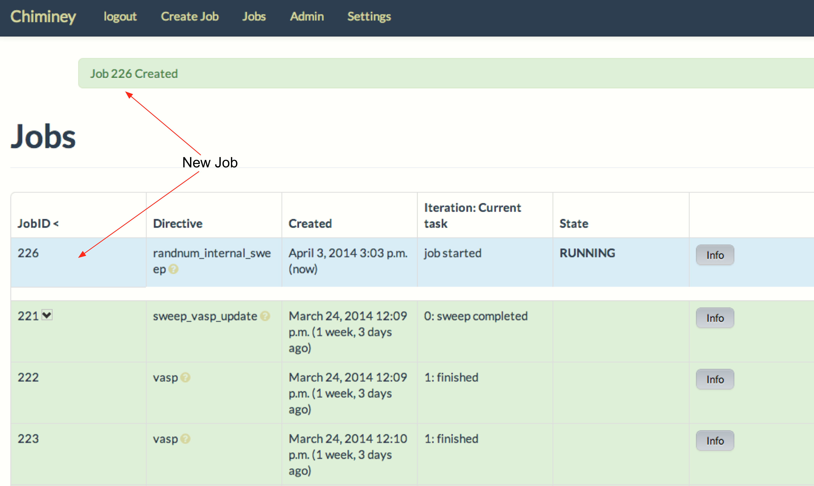
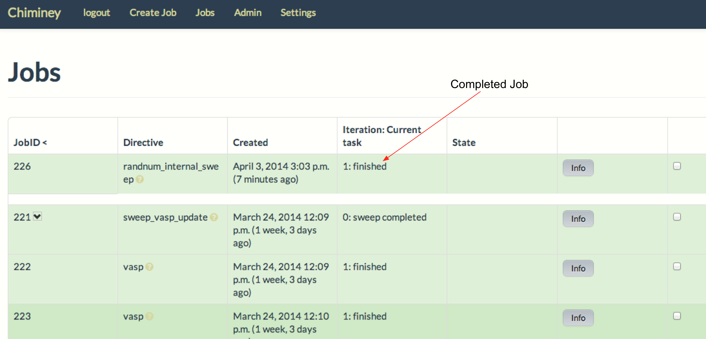

.. _internal_sweep_randnum:

The Internal Sweep Random Number Smart Connector
================================================

In this example, we create a smart connector with an :ref:`internal parameter sweep <internal_parameter_sweep>`.
When this smart connector  is executed, it spawns two tasks, each task generating a pair of random numbers.
We assume the computation platform for this connector to be a cloud-based infrastructure.
If two virtual machines (VMs) are available, each task will run on its own VM.
When both tasks complete execution, their output
will be  transferred  to a user-designated
location.
We call this smart connect the *internal sweep random number smart connector*.

- The **purpose** of this example is to create a smart connector with an :ref:`internal parameter sweep <internal_parameter_sweep>`.

- The **source code** for this example is available at ``chiminey/examples/randnuminternalsweep``.

Requirements
------------

#. Installation and configuration of the Chiminey server on a virtual machine,
   according to the :ref:`Installation Guide <installation_guide>`.

#. Registration of a cloud computation platform, which is where the core
   functionality of a smart connector is executed within the Chiminey
   UI (see registering :ref:`Cloud Computation Platform <cloud_resource>`).
#. Registration of a storage platform, which is the destination of the
   smart connector output within the Chiminey UI. As with other storage
   platforms, the platform could be any unix server, again
   including the Chiminey server itself (see registering :ref:`Unix Storage Platform <unix_storage_platform>`).

Creating the Internal Sweep Random Number Smart Connector
---------------------------------------------------------

Here, we a create the internal sweep random number :ref:`smart connector <smart_connector_desc>`.
For this, we need to carry out the following steps, in order:

#. :ref:`customise <customize_parent_stage>`  the parent stage to update the :ref:`sweep map <sweep_map>`,

#. :ref:`prepare <prepare_payload_internal_sweep>` a payload

#. :ref:`define <define_internal_sweep_conn>`   the smart connector with the new
   parent stage and the pre-defined core stages, and

#. :ref:`register  <register_internal_sweep>` the smart connector within Chiminey so it can be executed.

.. _customize_parent_stage:

Customizing the Parent Stage
~~~~~~~~~~~~~~~~~~~~~~~~~~~~

The customised parent stage, i.e., ``RandParent``, is available at ``chiminey/examples/randnuminternalsweep/randparent.py``.

#. ``RandParent`` subclasses the core parent stage ``Parent``,
   which is located at ``chiminey/corestages/parent.py``. ``RandParent`` overwrites
   ``get_internal_sweep_map(self, ....)`` to
   include a new sweep map; the cross-product of the values of the parameters  in the new sweep map is two.

#. Here is the new sweep map that enables the execution  of two tasks within a single job submission, ``{'var': [1, 2]}``.
   ``var`` is an :ref:`unknown parameter <unknown_param>`.

Below is the content of the ``RandParent`` class:

::

    from chiminey.corestages import Parent

    class RandParent(Parent):
        def get_internal_sweep_map(self, settings, **kwargs):
            rand_index = 42
            map = {'var': [1, 2]}
            return map, rand_index

.. _prepare_payload_internal_sweep:

Preparing a Payload
~~~~~~~~~~~~~~~~~~~

We now discuss how to prepare a :ref:`payload <payload>` for the internal sweep random number smart connector.
This step is required because the computation platform of this smart connector is
a cloud infrastructure and :ref:`all cloud-based smart connectors must include their domain-specific executables in a payload <payload>`.

**NB:** The payload for the internal sweep random number smart connector is available at ``chiminey/examples/randnuminternalsweep/payload_randnum``.

#. The Chiminey server expects  payloads to be under ``LOCAL_FILESYS_ROOT_PATH``,
   which is ``/var/chiminey/remotesys`` by default. A subdirectory can be created under ``LOCAL_FILESYS_ROOT_PATH``
   to better organise payloads. On such occasions,
   :ref:`the Chiminey server must be configured to point to the subdirectory <define_internal_sweep_conn>`.
   Let's now  create a subdirectory ``my_payloads``, and then put ``payload_randnum`` under it.

   ::

       mkdir -p /var/chiminey/remotesys/my_payloads
       cp -r  /opt/chiminey/current/chiminey/examples/randnuminternalsweep/payload_randnum /var/chiminey/remotesys/my_payloads/

#. As recommended in :ref:`payload <payload>`, ``payload_template`` is used as the starting point to prepare ``payload_randnum``.
   In order to satisfy   the requirements of this smart connector, ``start_running_process.sh`` will be changed.

    a. ``start_running_process.sh`` includes  the logic for generating the random numbers. As :ref:`expected by the Chiminey server <proc_running_script>`,
       the output of the program is redirected to ``chiminey``. Since this random generator is synchronous,
       the process ID is not  saved. Here is the content of ``start_running_process.sh``:

       ::

            #!/bin/sh
            python -c 'import random;  print random.random(); print random.random()'  >& chiminey/rand

    b. ``process_running_done.sh`` remains the same because the random number generating program is synchronous.

    c. ``start_bootstrap.sh`` and ``bootstrap_done.sh`` remain the same. This is because the random number
       generation depends only on ``python``, and the  included ``python`` in  linux-based OS  fulfills the requirement.

    d. ``start_process_schedule.sh`` and  ``start_running_process.sh`` remain the same because there is no process-level
       configuration requirement.

.. _define_internal_sweep_conn:

Defining the Internal Random Number Smart Connector
~~~~~~~~~~~~~~~~~~~~~~~~~~~~~~~~~~~~~~~~~~~~~~~~~~~

The   definition of this smart connector, i.e., ``RandNumInternaSweepInitial``, is available at ``chiminey/examples/randnuminternalsweep/initialise.py``.

#. ``RandNumInternaSweepInitial`` subclasses ``CoreInitial``, which is located at ``chiminey/initialise/coreinitial.py``.
   ``RandNumInternaSweepInitial``  overwrites ``get_updated_parent_params(self)``, ``get_updated_bootstrap_params(self)`` and
   ``get_ui_schema_namespace(self)``.

#. In the :ref:`previous step  <customize_parent_stage>`, the parent stage is customised. Therefore, ``get_updated_parent_params(self)``
   updates the package path  to point to the customised parent stage class, which is
   ``chiminey.examples.randnuminternalsweep.randparent.RandParent``.

#. ``get_updated_bootstrap_params(self)`` updates settings to point the Chiminey server to the location of  the new payload.
   The location of any payload is given relative to ``LOCAL_FILESYS_ROOT_PATH``. Since we :ref:`previously <prepare_payload_internal_sweep>`
   copied ``payload_randnum`` to  ``LOCAL_FILESYS_ROOT_PATH/my_payloads/payload_randnum``, the location of the payload is
   ``my_payloads/payload_randnum``.

#. The new ``get_ui_schema_namespace(self)`` contains three schema namespaces that represent three types of input fields
   for specifying the name of a cloud-based computation platform, the maximum and minimum number of VMs  needed for the job,
   and an output location (see :ref:`chiminey_ui`).

Below is the content of ``RandNumInternaSweepInitial``.

::

    from chiminey.initialisation import CoreInitial

    class RandNumInternaSweepInitial(CoreInitial):
        def get_updated_parent_params(self):
            return {'package': "chiminey.examples.randnuminternalsweep.randparent.RandParent"}

        def get_updated_bootstrap_params(self):
            settings = {
                    u'http://rmit.edu.au/schemas/stages/setup':
                        {
                            u'payload_source': 'my_payloads/payload_randnum',
                        },
                }
            return {'settings': settings}

        def get_ui_schema_namespace(self):
            RMIT_SCHEMA = "http://rmit.edu.au/schemas"
            schemas = [
                    RMIT_SCHEMA + "/input/system/compplatform/cloud",
                    RMIT_SCHEMA + "/input/system/cloud",
                    RMIT_SCHEMA + "/input/location/output",
                    ]
            return schemas

.. _register_internal_sweep:

Registering the Internal Sweep Random Number Smart Connector within Chiminey
~~~~~~~~~~~~~~~~~~~~~~~~~~~~~~~~~~~~~~~~~~~~~~~~~~~~~~~~~~~~~~~~~~~~~~~~~~~~

A smart connector can be registered within the Chiminey server in various ways. Here,
a `Django management command <https://docs.djangoproject.com/en/dev/howto/custom-management-commands/#management-commands-and-locales>`__ is used.
``chiminey/smartconnectorscheduler/management/commands/randnuminternalsweep.py`` contains the Django management command for registering the
internal sweep
random number smart connector. Below is the full content.

::

    from django.core.management.base import BaseCommand
    from chiminey.examples.randnuminternalsweep.initialise import RandNumInternaSweepInitial

    MESSAGE = "This will add a new directive to the catalogue of" \
              " available connectors.  Are you sure [Yes/No]?"

    class Command(BaseCommand):
        """
        Load up the initial state of the database (replaces use of
        fixtures).  Assumes specific structure.
        """

        args = ''
        help = 'Setup an initial task structure.'

        def setup(self):
            confirm = raw_input(MESSAGE)
            if confirm != "Yes":
                print "action aborted by user"
                return

            directive = RandNumInternaSweepInitial()
            directive.define_directive(
                'randnum_internal_sweep', description='RandNum Internal Sweep')
            print "done"

        def handle(self, *args, **options):
            self.setup()
            print "done"

#. When registering a smart connector, a **unique name** must be provided. In this case, *randnum_internal_sweep*.
   If a smart connector exists with the same name, the command will be ignored.

#. A short **description** is also needed. In this case, *RandNum Internal Sweep*.
   Both the unique name and the description will be displayed on the Chiminey UI.

#. Execute the following commands on the Chiminey server terminal.

   ::

        sudo su bdphpc
        cd /opt/chiminey/current
        bin/django randnuminternalsweep
        Yes

#. Visit your Chiminey web page; click ``Create Job``. You should see ``RandNum Internal Sweep`` under ``Smart Connectors`` menu.

   .. figure:: img/randnuminternalsweep/create_connector.png
        :align: center
        :alt: The Internal Sweep Random Number Smart Connector
        :figclass: align-center

        Figure. The Internal Sweep Random Number Smart Connector

.. _test_randnuminternalsweep:

Testing the Internal Sweep Random Number Smart Connector
""""""""""""""""""""""""""""""""""""""""""""""""""""""""

Now, test the correct definition and registration of the
internal sweep random number smart connector.  For this, you will :ref:`submit  <test_submit_job_internal_sweep>`
a cloud random number smart connector job,
:ref:`monitor <test_monitor_job_internal_sweep>`  the job,
and :ref:`view <test_view_output_internal_sweep>` the output of the job.

.. _test_submit_job_internal_sweep:

Submit an internal sweep random number smart connector job
''''''''''''''''''''''''''''''''''''''''''''''''''''''''''

See :ref:`Job Submission <submit_job>` for details.

    Figure. An internal sweep random number smart connector job is submitted

.. _test_monitor_job_internal_sweep:

Monitor the progress of the job
'''''''''''''''''''''''''''''''

See :ref:`Job Monitoring <monitor_job>` for details.

**NB**: Since the two tasks are internal to the job, they are not shown on the monitoring page.

    Figure. An internal sweep random number smart connector job is completed

.. _test_view_output_internal_sweep:

View job output
'''''''''''''''

Since this smart connector has two internal tasks, there will be two sets of outputs  when the job is completed.

#. Login to your storage platform
#. Change directory to the root path of your storage platform
#. The output is located under *smart_connector_uniquenameJOBID*, e.g. randnum_internal_sweep226
